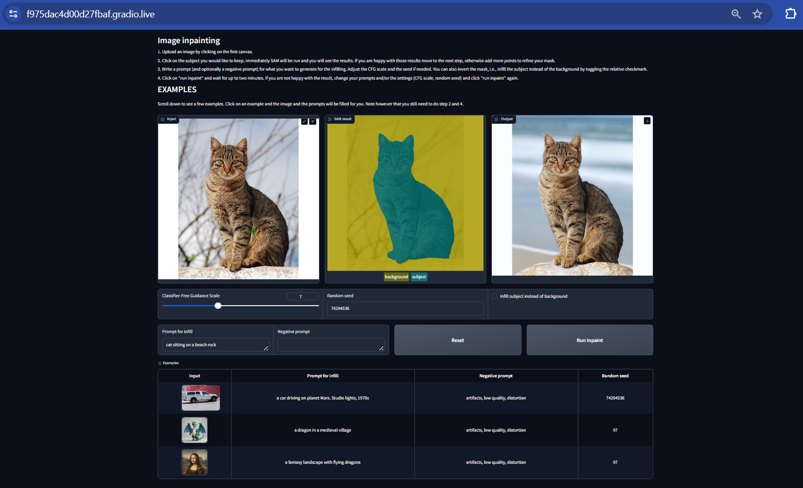

# AI_Photo_Editing
Using Generative AI and segmentation(SAM) models to edit photos change foreground and background  
The UI build with gradio helps to interact with the software.  
Steps:
1. upload image
2. click few points to segment
3. add text prompt
4. click Run inpaint button

Preview:

